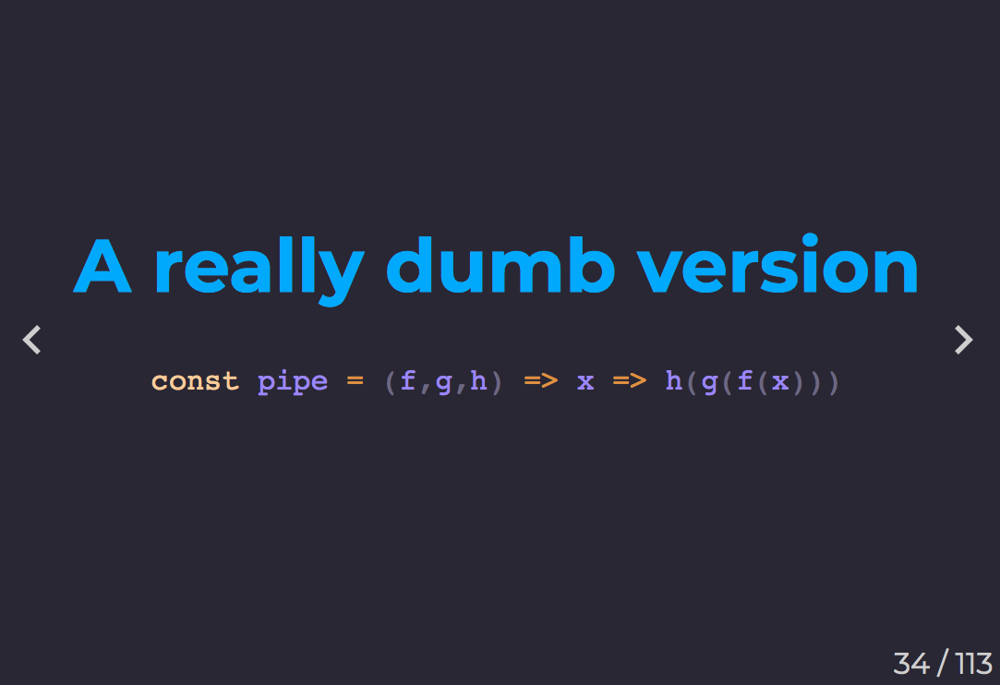
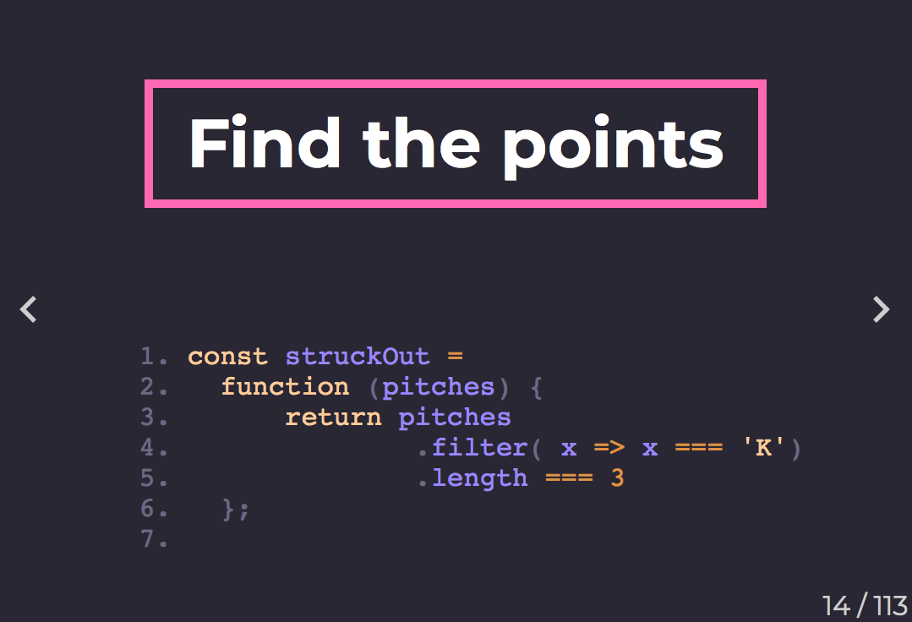

##

See it at https://markborcherding.github.io/pointless-javascript/#/

## Reference

The Spectacle core API is available at [https://github.com/FormidableLabs/spectacle/blob/master/README.md](https://github.com/FormidableLabs/spectacle/blob/master/README.md).

## Getting Started

```bash
npm install
```

Then, to start up the local server, run
```bash
npm start
```

Open a browser and hit [http://localhost:3000](http://localhost:3000), and we are ready to roll.

## Controls

| Key Combination | Function                       |
| --------------- | ------------------------------ |
| Right Arrow     | Next Slide                     |
| Left Arrow      | Previous Slide                 |
| Space           | Next Slide                     |
| Down Arrow      | Next Code Highlight            |
| Up Arrow        | Previous Code Highlight        |
| Shift+Space     | Previous Slide                 |
| Alt/Option + O  | Toggle Overview Mode           |
| Alt/Option + P  | Toggle Presenter Mode          |
| Alt/Option + T  | Toggle Timer in Presenter Mode |
| Alt/Option + A  | Start autoplay (if enabled)    |

## Code Slides

There are two types of code slides; static and interactive.

### Static Code

Static code slides have no interactions. They behave like normal slides




### Interactive Code Slides

Interactive code slides highlight regions of the code using the up and down arrows. 




## Presenter View

Open a browser to [http://localhost:3000/#/0?presenter&timer](http://localhost:3000/#/0?presenter&timer) and another window on the presentation display to [http://localhost:3000](http://localhost:3000).


## TODO Changes

* Remove the current cond example with a different one 
* show an example of composing a new function to do a single map rather than several sequential maps
* show the terrible stack traces...and maybe the much better ones from Sanctuary
